# OpenEnvoy CRM Dashboard

A modern, production-ready CRM dashboard built with React, TypeScript, and Redux Toolkit. Features a component-driven architecture, design token system, and comprehensive testing.


---

## Table of Contents

- [Quick Start](#quick-start)
- [Available Commands](#available-commands)
- [Project Architecture](#project-architecture)
- [Directory Structure](#directory-structure)
- [Core Concepts](#core-concepts)
- [Component Library](#component-library)
- [State Management](#state-management)
- [Routing](#routing)
- [Styling System](#styling-system)
- [Testing](#testing)

---

## Quick Start

### Prerequisites

- Node.js 18+
- npm 9+

### Installation

```bash
# Clone the repository
git clone https://github.com/your-org/open-envoy-crm.git
cd open-envoy-crm

# Install dependencies
npm install

# Start development server
npm run dev
```

The app will be available at `http://localhost:5173`

---

## Available Commands

| Command | Description |
|---------|-------------|
| `npm run dev` | Start development server with hot reload |
| `npm run build` | Type-check and build for production |
| `npm run preview` | Preview production build locally |
| `npm run lint` | Run ESLint for code quality |
| `npm run test` | Run tests in watch mode |
| `npm run test:ui` | Run tests with Vitest UI |
| `npm run test:coverage` | Generate test coverage report |
| `npm run storybook` | Start Storybook component explorer |
| `npm run build-storybook` | Build static Storybook site |

---

## Project Architecture

### High-Level Overview

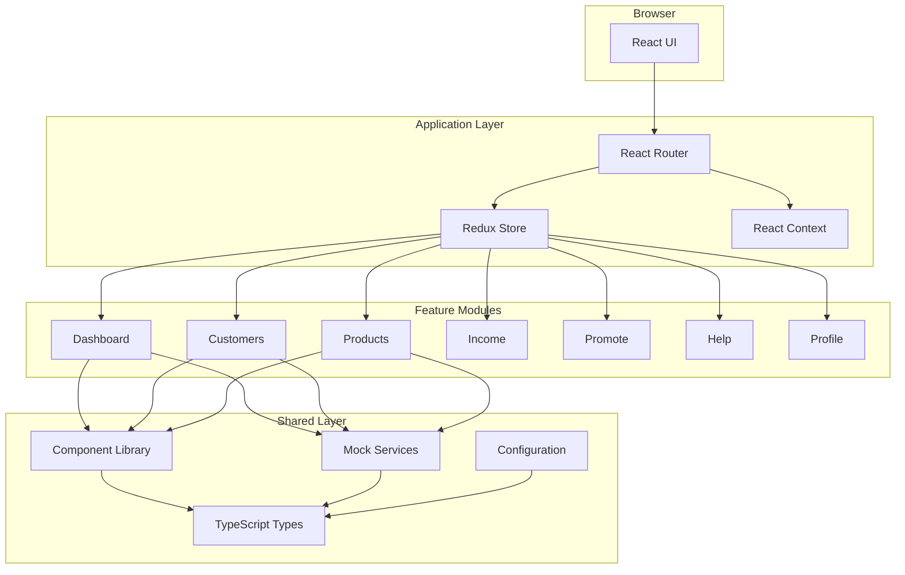

### Request Flow

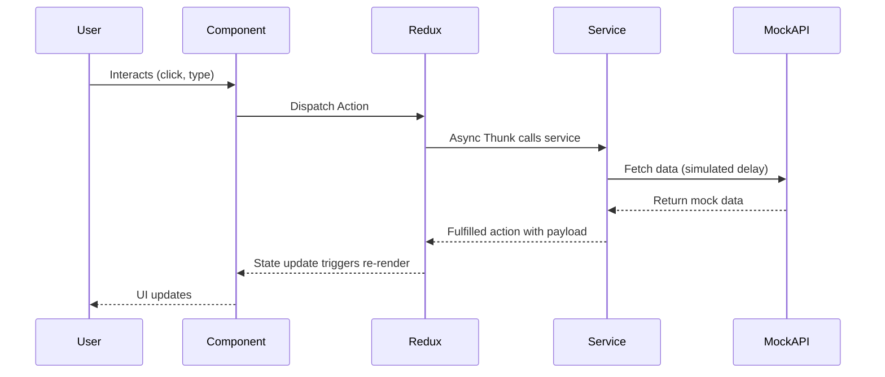

### Component Architecture

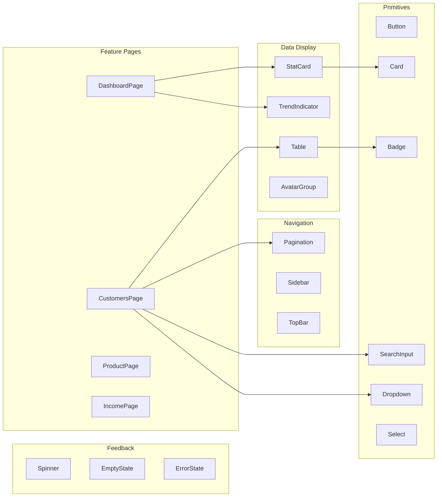

---

## Directory Structure

```
src/
├── components/           # Reusable UI components
│   ├── primitives/       # Basic building blocks (Button, Badge, Card)
│   ├── data-display/     # Data presentation (Table, StatCard)
│   ├── feedback/         # User feedback (Spinner, EmptyState)
│   └── navigation/       # Navigation components (Pagination)
│
├── features/             # Feature-based modules
│   ├── customers/        # Customer management
│   │   ├── CustomersPage.tsx
│   │   ├── CustomersPage.module.css
│   │   ├── customersSlice.ts
│   │   └── index.ts
│   ├── dashboard/        # Main dashboard
│   ├── product/          # Product management
│   ├── income/           # Income tracking
│   ├── promote/          # Campaign management
│   ├── help/             # Help & FAQs
│   └── profile/          # User profile
│
├── layouts/              # Page layouts
│   ├── DashboardLayout.tsx
│   ├── Sidebar/
│   └── TopBar/
│
├── services/             # API/data services
│   ├── customerService.ts
│   ├── dashboardService.ts
│   └── ...
│
├── store/                # Redux store configuration
│   ├── store.ts
│   └── hooks.ts
│
├── config/               # App configuration
│   ├── navigation.ts     # Sidebar nav config
│   └── iconRegistry.ts   # Icon mapping
│
├── types/                # TypeScript type definitions
│   ├── customer.ts
│   ├── dashboard.ts
│   └── ...
│
├── styles/               # Global styles
│   ├── tokens.css        # Design tokens
│   └── global.css        # Base styles
│
├── contexts/             # React contexts
│   └── UserContext.tsx
│
├── routes.tsx            # Route definitions
├── App.tsx               # Root component
└── main.tsx              # Entry point
```

---

## Core Concepts

### 1. Feature-Based Architecture

Each feature is self-contained with its own:
- **Page Component** - The main UI
- **Redux Slice** - State management
- **CSS Module** - Scoped styles
- **Index Export** - Clean public API

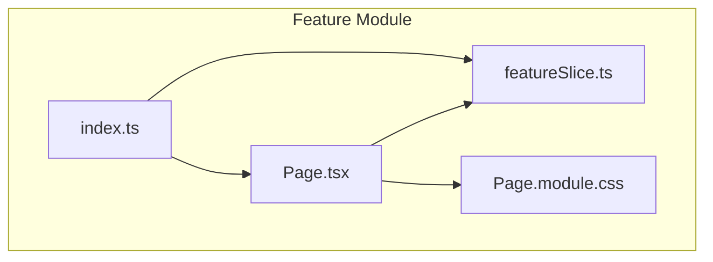

**Example: Customers Feature**

```typescript
// src/features/customers/index.ts
export { CustomersPage } from './CustomersPage'
export { default as customersReducer } from './customersSlice'
export * from './customersSlice'  // Selectors and actions
```

### 2. Config-Driven Navigation

The sidebar is fully configurable via `src/config/navigation.ts`:

```typescript
// Add a new page in 3 steps:
// 1. Add to navigation config
{ icon: 'Settings', label: 'Settings', path: '/settings' }

// 2. Create the feature module
// 3. Add route to routes.tsx
```

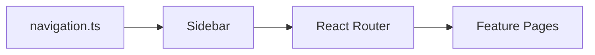

### 3. Design Token System

All visual properties use CSS custom properties for consistency:

```css
/* src/styles/tokens.css */
:root {
  /* Colors */
  --color-accent: #5932EA;
  --color-text: #292D32;

  /* Spacing */
  --spacing-md: 16px;
  --spacing-lg: 24px;

  /* Typography */
  --font-size-sm: 14px;
  --font-weight-medium: 500;
}
```

**Benefits:**
- Single source of truth
- Easy theme customization
- Consistent spacing/sizing
- IDE autocomplete support

---

## Component Library

### Component Categories

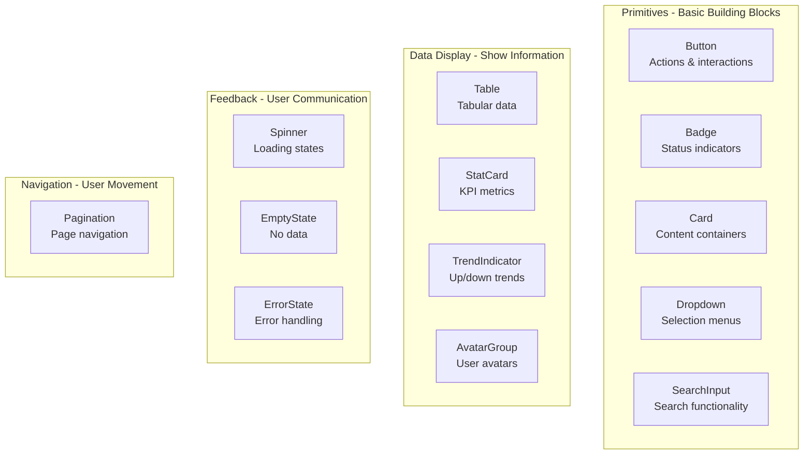

### Using Components

```tsx
import {
  Table,
  Pagination,
  SearchInput,
  Dropdown,
  Badge,
  Spinner
} from '@/components'

function MyPage() {
  return (
    <>
      <SearchInput placeholder="Search..." onChange={handleSearch} />
      <Dropdown options={sortOptions} value={sort} onChange={setSort} />
      <Table columns={columns} data={data} rowKey={(row) => row.id} />
      <Pagination currentPage={1} totalPages={10} onPageChange={setPage} />
    </>
  )
}
```

---

## State Management

### Redux Store Structure

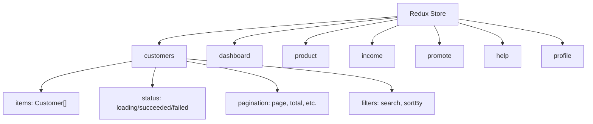

### Slice Pattern

Each feature uses Redux Toolkit's `createSlice` with async thunks:

```typescript
// 1. Define async thunk
export const fetchCustomers = createAsyncThunk(
  'customers/fetchCustomers',
  async (params: QueryParams) => {
    return await customerService.getCustomers(params)
  }
)

// 2. Create slice with reducers
const customersSlice = createSlice({
  name: 'customers',
  initialState,
  reducers: {
    setSearch: (state, action) => { state.search = action.payload },
    setSortBy: (state, action) => { state.sortBy = action.payload },
  },
  extraReducers: (builder) => {
    builder
      .addCase(fetchCustomers.pending, (state) => {
        state.status = 'loading'
      })
      .addCase(fetchCustomers.fulfilled, (state, action) => {
        state.status = 'succeeded'
        state.customers = action.payload.data
      })
  }
})

// 3. Export selectors
export const selectCustomers = (state: RootState) => state.customers.customers
export const selectStatus = (state: RootState) => state.customers.status
```

### Data Flow

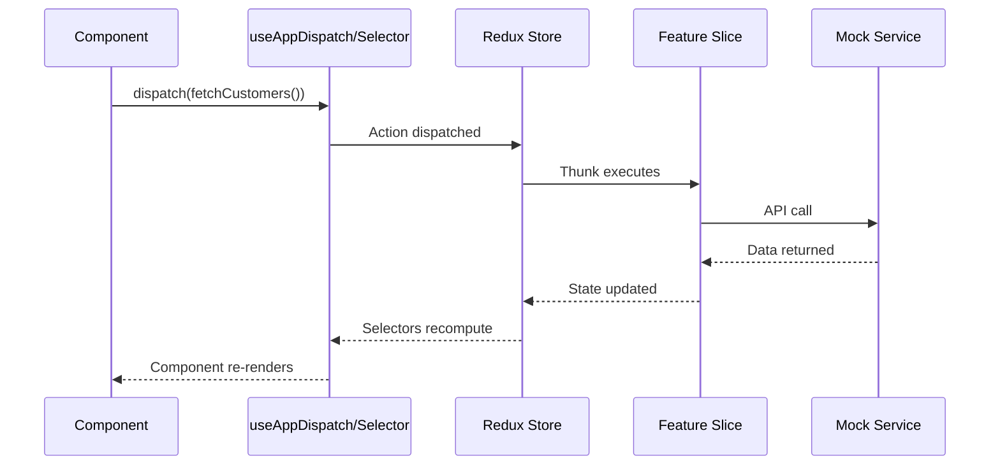

---

## Routing

### Route Configuration

```typescript
// src/routes.tsx
export const routes: RouteConfig[] = [
  { path: '/', element: <Navigate to="/dashboard" replace /> },
  { path: '/dashboard', element: <DashboardPage /> },
  { path: '/product', element: <ProductPage /> },
  { path: '/customers', element: <CustomersPage /> },
  { path: '/income', element: <IncomePage /> },
  { path: '/promote', element: <PromotePage /> },
  { path: '/help', element: <HelpPage /> },
  { path: '/profile', element: <ProfilePage /> },
]
```

### Navigation Flow

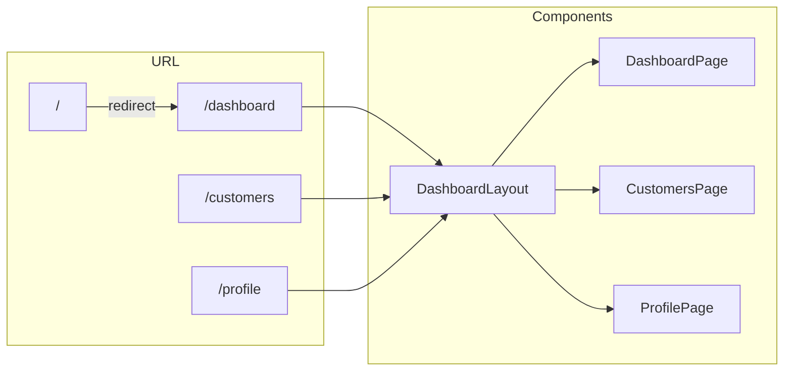

---

## Styling System

### CSS Modules + Design Tokens

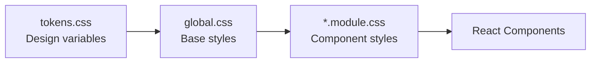

### Example Usage

```css
/* Component.module.css */
.container {
  padding: var(--spacing-lg);           /* 24px */
  background: var(--color-surface);      /* #FFFFFF */
  border-radius: var(--radius-sm);       /* 8px */
  box-shadow: var(--shadow-sm);
}

.title {
  font-size: var(--font-size-lg);        /* 18px */
  font-weight: var(--font-weight-semibold);
  color: var(--color-text);
}
```

### Token Categories

| Category | Examples | Purpose |
|----------|----------|---------|
| Colors | `--color-accent`, `--color-text` | Brand & semantic colors |
| Spacing | `--spacing-sm`, `--spacing-lg` | Consistent margins/padding |
| Typography | `--font-size-md`, `--font-weight-bold` | Text styling |
| Borders | `--radius-sm`, `--color-border` | Element boundaries |
| Shadows | `--shadow-sm`, `--shadow-lg` | Depth & elevation |
| Layout | `--sidebar-width`, `--topbar-height` | Structural dimensions |

---

## Testing

### Test Structure

```
src/
├── components/
│   └── Table/
│       ├── Table.tsx
│       └── Table.test.tsx      # Component tests
├── features/
│   └── customers/
│       ├── CustomersPage.tsx
│       ├── CustomersPage.test.tsx  # Integration tests
│       └── customersSlice.test.ts  # Unit tests
└── test/
    ├── setup.ts               # Test configuration
    └── utils/
        └── renderWithProviders.tsx  # Test utilities
```

### Testing Utilities

```typescript
// Render with Redux store
import { renderWithProviders } from '@/test/utils/renderWithProviders'

test('renders customers', async () => {
  renderWithProviders(<CustomersPage />)

  await waitFor(() => {
    expect(screen.getByText('John Doe')).toBeInTheDocument()
  })
})
```

### Running Tests

```bash
# Watch mode (development)
npm run test

# Single run (CI)
npm run test -- --run

# With coverage
npm run test:coverage

# Visual UI
npm run test:ui
```

---

## Adding a New Feature

### Step-by-Step Guide

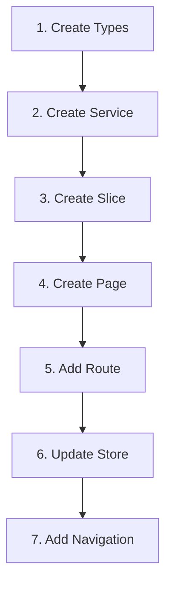

1. **Create Types** (`src/types/newFeature.ts`)
2. **Create Service** (`src/services/newFeatureService.ts`)
3. **Create Slice** (`src/features/newFeature/newFeatureSlice.ts`)
4. **Create Page** (`src/features/newFeature/NewFeaturePage.tsx`)
5. **Add Route** (`src/routes.tsx`)
6. **Update Store** (`src/store/store.ts`)
7. **Add Navigation** (`src/config/navigation.ts`)

---

## Tech Stack

| Technology | Purpose |
|------------|---------|
| **React 18** | UI library with hooks |
| **TypeScript** | Type safety |
| **Redux Toolkit** | State management |
| **React Router 7** | Client-side routing |
| **Vite** | Build tool & dev server |
| **Vitest** | Unit & integration testing |
| **Storybook** | Component documentation |
| **CSS Modules** | Scoped styling |
| **Lucide React** | Icon library |

---

## License

MIT License - see [LICENSE](LICENSE) for details.
